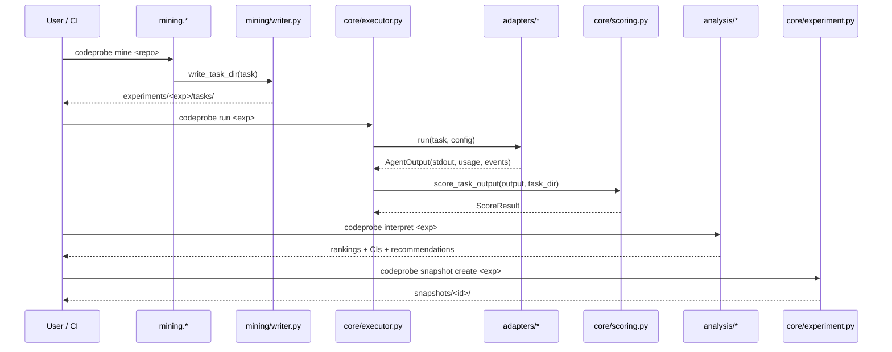

# codeprobe Architecture Tour

> Process Precondition P3 of the *Enterprise Repo Benchmark Parity* PRD
> (`docs/prd/prd_enterprise_repo_benchmark_parity.md`). Reading time: ~30 min.
> Audience: anyone landing Phase 2+ code, anyone onboarding to the project,
> anyone debugging a failed mine/run.

This tour diagrams the end-to-end pipeline (`mine` → `run` → `aggregate` →
`snapshot`), names the entry-point module for every stage, and covers the
CodeScaleBench ↔ EnterpriseBench schema divergences that currently live in
Medium articles and the author's head.

## Table of Contents

1. [The 10,000 ft view](#the-10000-ft-view)
2. [Pipeline diagram](#pipeline-diagram)
3. [Stage 1 — Mine](#stage-1--mine)
4. [Stage 2 — Run](#stage-2--run)
5. [Stage 3 — Aggregate](#stage-3--aggregate)
6. [Stage 4 — Snapshot](#stage-4--snapshot)
7. [CSB ↔ EB schema divergences](#csb--eb-schema-divergences)
8. [Module entry points cheat sheet](#module-entry-points-cheat-sheet)
9. [Common failure modes](#common-failure-modes)
10. [Glossary](#glossary)

---

## The 10,000 ft view

codeprobe is an AI-coding-agent benchmark pipeline. A user points it at one
or more repositories and runs four sequential stages:

| Stage | Purpose | Primary CLI | State |
| --- | --- | --- | --- |
| Mine | Extract benchmark tasks from history (PRs, commits, MCP-exercisable patterns) | `codeprobe mine` | `experiments/<exp>/tasks/` |
| Run | Execute each task against one or more agent configs | `codeprobe run` | `experiments/<exp>/runs/<config>/<task>/` |
| Aggregate | Score, compare, and rank configs across the task suite | `codeprobe interpret` | `experiments/<exp>/aggregate/` |
| Snapshot | Publish a sanitized, portable export bundle | `codeprobe snapshot` | `snapshots/<id>/` |

The modules that carry each stage are:

- **Mine**: `src/codeprobe/mining/` — `writer.py`, `extractor.py`, `curator.py`,
  `org_scale.py`, `sg_ground_truth.py` (plus helper families in
  `org_scale_families.py`, `org_scale_oracle.py`, `org_scale_scanner.py`,
  `org_scale_validate.py`, and `task_types.py`).
- **Run**: `src/codeprobe/adapters/` — `claude.py`, `copilot.py`, `codex.py`
  (plus `_base.py`, `protocol.py`, `session.py`, `telemetry.py`,
  `openai_compat.py`) and the orchestration in `src/codeprobe/core/executor.py`.
- **Score**: `src/codeprobe/core/scoring.py` — implements the scorer Protocol
  and every built-in scorer (`BinaryScorer`, `ContinuousScorer`,
  `CheckpointScorer`, `ArtifactScorer`, `DualScorer`) plus sandboxed execution
  of `test.sh`.
- **Aggregate**: `src/codeprobe/analysis/` — `stats.py`, `ranking.py`,
  `report.py`, `dual.py`.
- **Snapshot**: `src/codeprobe/core/experiment.py`, the
  `src/codeprobe/probe/` subpackage, and the export paths in `cli/`.

## Pipeline diagram

High-level data flow, from repo history to a sharable snapshot:

```
 ┌─────────────────────┐
 │  Target repo(s)     │
 │  (GitHub / GitLab / │
 │   Bitbucket / local │
 │   mirror)           │
 └──────────┬──────────┘
            │
            │  git log, gh api, sg api, AST parse
            ▼
 ┌─────────────────────────────────────────────────────────────┐
 │  MINE                                                       │
 │                                                             │
 │  mining/extractor.py                                        │
 │    list_merged_prs()     ──►   mine_tasks()                 │
 │    resolve_pr_metadata()       extract_task_from_merge()    │
 │                                                             │
 │  mining/org_scale.py                                        │
 │    mine_org_scale_tasks() ──►  generate_org_scale_task()    │
 │    _mine_symbol_reference_tasks() / _mine_change_scope...   │
 │                                                             │
 │  mining/sg_ground_truth.py                                  │
 │    enrich_ground_truth() ──►  SourcegraphSymbolResolver     │
 │                                                             │
 │  mining/curator.py                                          │
 │    CurationPipeline ──►  merge_results() ──►  CuratedFile   │
 │                                                             │
 │  mining/writer.py                                           │
 │    write_task_dir()     ──►  instruction.md                 │
 │                               instruction_mcp.md (R1)       │
 │                               metadata.json                 │
 │                               tests/test.sh                 │
 │                               answer.json (R2)              │
 └──────────┬──────────────────────────────────────────────────┘
            │
            │  codeprobe run <exp> --config <agent>
            ▼
 ┌─────────────────────────────────────────────────────────────┐
 │  RUN                                                        │
 │                                                             │
 │  core/executor.py                                           │
 │    schedule tasks across parallel slots                     │
 │    hand each task to the configured adapter                 │
 │                                                             │
 │  adapters/claude.py      ── ClaudeAdapter  ─┐               │
 │  adapters/copilot.py     ── CopilotAdapter ─┼─► AgentOutput │
 │  adapters/codex.py       ── CodexAdapter   ─┘               │
 │                                                             │
 │  adapters/telemetry.py   cost / token extraction            │
 │  adapters/session.py     session collector (interactive)    │
 │                                                             │
 │  core/scoring.py                                            │
 │    get_scorer()          dispatch by reward_type            │
 │    score_task_output()   sandboxed test.sh execution        │
 │    ArtifactScorer        JSON retrieval scoring (R2 path)   │
 │    CheckpointScorer      multi-step partial credit (R17)    │
 └──────────┬──────────────────────────────────────────────────┘
            │
            │  codeprobe interpret <exp>
            ▼
 ┌─────────────────────────────────────────────────────────────┐
 │  AGGREGATE                                                  │
 │                                                             │
 │  analysis/stats.py                                          │
 │    summarize_config()     per-config ConfigSummary          │
 │    compare_configs()      pairwise McNemar / Wilcoxon       │
 │    wilson_ci() / cohens_d / cliffs_delta                    │
 │                                                             │
 │  analysis/ranking.py                                        │
 │    rank_configs()         deterministic ordering            │
 │    _build_recommendation()                                  │
 │                                                             │
 │  analysis/report.py       human-readable summary            │
 │  analysis/dual.py         dual-scorer reconciliation        │
 └──────────┬──────────────────────────────────────────────────┘
            │
            │  codeprobe snapshot create <exp> --out <id>
            ▼
 ┌─────────────────────────────────────────────────────────────┐
 │  SNAPSHOT                                                   │
 │                                                             │
 │  core/experiment.py    bundle layout + manifest             │
 │  probe/                observability + export adapters      │
 │                                                             │
 │  snapshots/<id>/                                            │
 │    SNAPSHOT.json       dependency + hash manifest (R18)     │
 │    summary/{rewards,aggregate,timing,costs}.json            │
 │    traces/             exported trace.db rows (R5)          │
 │    export/traces/<config>/<task>/  per-task bundles         │
 │    browse.html         airgap-safe fallback viewer (R19)    │
 └─────────────────────────────────────────────────────────────┘
```

The same flow as a Mermaid sequence:



## Stage 1 — Mine

### Goal

Turn repository history into a suite of executable, test-verified benchmark
tasks. Each task lands on disk in a self-contained directory with
`instruction.md`, `metadata.json`, `tests/test.sh`, and (for retrieval-style
tasks) an `answer.json`.

### Entry points

- **`mining/extractor.py`** — classic PR-shaped mining.
  - `list_merged_prs(source, path, limit)` (line 170) picks the merged-PR
    source — `_list_merged_prs_gh()` (line 79) if `gh` auth is present,
    `_list_merged_prs_git()` (line 137) as the fallback. This is where the
    "PR/MR vs plain commits vs RFC" split in R9 plugs in.
  - `mine_tasks(...)` (line 1195) is the orchestration point: iterate merges,
    call `extract_task_from_merge()` (line 957), apply filtering, and return
    a `MineResult` (line 1078).
  - `generate_instruction(...)` (line 1376) is the *only* intentionally
    model-backed call in the extractor (ZFC-compliant per CLAUDE.md);
    `_estimate_difficulty()` (line 341) is a known ZFC violation tracked
    for refactor.
- **`mining/org_scale.py`** — org-scale patterns that don't map to a single
  PR: symbol-reference fan-out, type-hierarchy walks, change-scope audits,
  dependency-trace chains.
  - `mine_org_scale_tasks(...)` (line 805) is the dispatcher. Fans out to
    `_mine_symbol_reference_tasks()` (line 506), `_mine_type_hierarchy_tasks()`
    (line 591), `_mine_change_scope_tasks()` (line 663), `_mine_mcp_families()`
    (line 752), and `_mine_pattern_families()` (line 347).
  - `generate_org_scale_task(...)` (line 221) synthesises the per-family
    `Task` object; `_build_task_gen_prompt()` (line 121) feeds the LLM
    question-generator.
  - R3 (oracle tier population) lives here — the tier strings at lines
    282/576/737 (still literal `"required"` today) are what the R3
    acceptance criteria rewrites against `curator_backends.invoke_model`.
- **`mining/curator.py`** — the model-backed curation layer.
  - `CurationPipeline` (line 227) composes multiple `CurationBackend`
    (Protocol, line 121) implementations and merges their votes via
    `merge_results(...)` (line 141).
  - `CuratedFile` (line 29), `MergeConfig` (line 41), `CurationResult`
    (line 50) are the value types that cross the boundary.
  - This is the ZFC chokepoint (INV3 in the PRD) — any mining code that
    needs a semantic string (`"low"|"medium"|"high"`, difficulty bands)
    routes through a backend here rather than hard-coding it.
- **`mining/sg_ground_truth.py`** — Sourcegraph-backed enrichment.
  - `enrich_ground_truth(task)` (line 25) is the entry point; it calls
    `_call_find_references()` (line 76) and runs the results through
    `SourcegraphSymbolResolver` (line 153) to promote PR-diff files from
    "required" to tiered ground truths for R3.
- **`mining/writer.py`** — the one place that materialises a task to disk.
  - `write_task_dir(task, repo_path, ...)` (line 678) is the single public
    entry point. Every other writer helper is module-private.
  - `_write_mcp_instruction_variant(...)` (line 1008) is where R1 lives —
    today gated only on `task_type == "mcp_tool_usage"` at line 780; R1
    widens the predicate.
  - `_write_oracle_task(...)` (line 1086) emits the `answer.json`
    oracle scaffolding; R2 rewrites this to the structured
    `{files, symbols, chain, text}` shape.
  - `_build_weighted_checklist_script()` (line 555) is the generator for
    the SDLC-schema weighted-checklist `test.sh` used by
    `CheckpointScorer`.
- **`mining/task_types.py`** — the registry that R3-new extends with
  enterprise task types (`dependency_upgrade`, `framework_migration`,
  `config_surgery`, `runbook_execution`, `observability_change`,
  `compliance_patch`).

### Outputs

A fully mined task directory looks like this on disk:

```
experiments/<exp>/tasks/<task_id>/
  instruction.md              # preamble + PR context + task contract
  instruction_mcp.md          # MCP-preamble variant (R1, once widened)
  metadata.json               # TaskMetadata: task_type, difficulty,
                              #   expected_tool_benefit, oracle_tiers,
                              #   enrichment_source, ...
  tests/test.sh               # verifier script, sandbox-executed
  answer.json                 # structured retrieval oracle (R2)
  checks/                     # per-checkpoint verifier scripts (R17)
```

## Stage 2 — Run

### Goal

Execute every task against every configured agent, capture a reproducible
trajectory, and hand a `ScoreResult` to the aggregator.

### Entry points

- **`core/executor.py`** — owns task scheduling, per-slot isolation, retries,
  parallel fan-out. Reads an experiment config and hands each
  `(task, agent_config)` pair to the adapter registered for
  `agent_config.adapter`.
- **`adapters/protocol.py`** — the `AgentAdapter` Protocol. Two methods carry
  the contract:
  - `preflight(config) -> list[str]` — returns a list of blocking issues,
    empty list means ok.
  - `run(task, config) -> AgentOutput` — returns the full transcript,
    usage, cost, timing, and event stream.
- **`adapters/_base.py`** — `BaseAdapter` with binary-on-PATH probes,
  cost-source annotation, the JsonStdoutCollector plumbing.
- **`adapters/claude.py`** — Claude Code CLI adapter.
  - `ClaudeAdapter` (line 181) is the published class.
  - `check_parallel_auth(parallel)` (line 199) is the auth-hygiene preflight
    that catches the "every parallel worker hits API 401" trap.
  - `_build_mirror_slot_env()` (line 113), `_effective_claude_config_dir()`
    (line 65), `_credentials_file_status()` (line 80) isolate
    `CLAUDE_CONFIG_DIR` per-slot so parallel workers don't race on
    OAuth refresh.
  - `_normalize_model_for_cli(model)` (line 56) maps logical model names
    to CLI model IDs; R13 will lift this into `model_registry.yaml`.
- **`adapters/copilot.py`** — GitHub Copilot CLI adapter.
  - `CopilotAdapter` (line 16) — thin, preflights that `gh` and
    `gh copilot` are installed, parses the Copilot envelope.
- **`adapters/codex.py`** — OpenAI Codex CLI adapter.
  - `CodexAdapter` (line 29) wraps the Codex CLI.
  - `_usage_fields(envelope)` (line 20) extracts token counts from the
    JSON envelope emitted by `codex`.
- **`adapters/telemetry.py`** — shared token/cost parsing. Used by every
  adapter so `usage` shape is consistent across backends.
- **`adapters/session.py`** — `SessionCollector` Protocol + reference
  implementation for interactive (non-headless) agents.
- **`adapters/openai_compat.py`** — OpenAI-compatible endpoint helper
  (vLLM / litellm / Bedrock-via-proxy) feeding R13's generic OpenAI backend.

### Scoring

- **`core/scoring.py`** — every scorer lives here.
  - `score_task_output(agent_output, task_dir)` (line 285) — the
    executor's entry point; internally runs `test.sh` inside a sandbox
    via `_run_in_sandbox()` (line 216) and emits a `ScoreResult`
    (line 96).
  - `get_scorer(reward_type, ...)` (line 1190) — dispatcher.
  - Scorers: `BinaryScorer` (line 302), `ContinuousScorer` (line 338),
    `CheckpointScorer` (line 406), `ArtifactScorer` (line 792),
    `DualScorer` (line 1032). Each implements the `Scorer` Protocol
    at line 111.
  - `sanitize_secrets(text)` (line 126) — the regex-based redaction used
    before any agent output is persisted; intentionally ZFC-exempt per
    CLAUDE.md (structural pattern match, not semantic judgment).
  - `validate_ground_truth(gt)` (line 718) — schema validator; the
    "validate-or-die" half of the premortem guidance.
  - Per-field scorers for R2's structured oracle: `score_file_list()`
    (line 608), `score_symbol_list()` (line 656),
    `score_dependency_chain()` (line 691), `score_exact_match()`
    (line 639).
- **`core/sandbox.py`** — Bubblewrap / nsjail wrapper. R_W replaces this
  with a container-based default.
- **`core/checkpoint.py`** — the per-checkpoint bookkeeping the
  `CheckpointScorer` reads.

### Outputs

```
experiments/<exp>/runs/<config>/<task_id>/
  agent_output.txt      # agent final message
  events.jsonl          # streaming trace (today) → trace.db row export (R5)
  scoring.json          # ScoreResult + per-check breakdown
  instruction.resolved.md  # (R6) fully-expanded prompt, one copy per run
  timing.json           # start / end / per-tool durations
```

## Stage 3 — Aggregate

### Goal

Roll per-task scores into per-config summaries, compute confidence intervals,
run pairwise significance tests, and rank the configurations.

### Entry points

- **`analysis/stats.py`**
  - `summarize_config(...)` (line 297) — produces a `ConfigSummary`
    (line 243) from a list of `CompletedTask`.
  - `summarize_completed_tasks(...)` (line 383) — higher-level shim
    that groups by config and calls `summarize_config`.
  - `compare_configs(...)` (line 528) — pairwise comparison returning
    `PairwiseComparison` (line 280) with per-pair `p_value`, effect size,
    and `winner`.
  - Score-type-aware CIs: `_is_binary()` (line 159) and
    `_choose_summary_ci()` (line 186) route binary data through
    `wilson_ci()` (line 64) and continuous data through
    `mean_score_ci()` (line 164).
  - Effect sizes: `cohens_d()` (line 142) and `cliffs_delta()` (line 129);
    tests: `mcnemars_exact_test()` (line 75), `wilcoxon_test()` (line 108).
- **`analysis/ranking.py`**
  - `rank_configs(summaries)` (line 29) — deterministic ordering, with
    explicit tiebreakers (see `_ordinal()` at line 20). This is the
    explicit ZFC-exception case in CLAUDE.md — deterministic arithmetic,
    not hidden judgment.
  - `_build_recommendation(...)` (line 81) — surfaces the recommended
    config plus a rationale string fed into `interpret` output.
- **`analysis/report.py`** — human-facing summary (markdown / HTML).
- **`analysis/dual.py`** — dual-scorer reconciliation when a task has two
  independent verifiers (EB-style dual verification).

### Outputs

```
experiments/<exp>/aggregate/
  summary.json           # per-config ConfigSummary
  pairwise.json          # every pair of configs, with p-values
  ranking.json           # deterministic rank + recommendation
  report.{md,html}       # human-facing
```

## Stage 4 — Snapshot

### Goal

Produce a portable, sanitized bundle that matches the CodeScaleBench snapshot
layout so reviewers and partner staff engineers can browse a completed
experiment without re-running it.

### Entry points

- **`core/experiment.py`** — bundle layout and `SNAPSHOT.json` manifest.
- **`probe/`** — observability adapters (Datadog, Sigma, Sheets) per R19.
- **`cli/`** — the `snapshot create` / `snapshot verify` /
  `snapshot export` subcommands.

### Redaction posture (R14)

Snapshot export defaults to `--redact=hashes-only`:

- `hashes-only`: zero source bytes in export, cryptographic proof via hash
  manifest in `SNAPSHOT.json`.
- `contents`: deterministic redaction of file bodies, path metadata
  preserved. Requires `--allow-source-in-export`.
- `secrets`: regex-only secret stripping. Explicitly documented as
  **not sufficient for external sharing**. Gated by the pre-publish
  canary prompt.

The pre-publish canary gate: `snapshot create` in `secrets` or `contents`
mode refuses to run until the user pastes a known canary string and the
scanner proves it would have caught it. This is the defence against PM4
("novel secret format slips through").

## CSB ↔ EB schema divergences

CodeScaleBench (CSB) and EnterpriseBench (EB) are the two upstream
benchmark shapes codeprobe targets parity with. They overlap a lot but
diverge in five places that have historically bitten contributors.

### 1. Task identity

- **CSB**: task identity is `(repo, commit_sha, task_slug)`. Tasks can be
  refreshed at new commits while keeping the slug.
- **EB**: task identity includes the verifier hash — changing the verifier
  script changes the task identity. Intentional — EB's verifiers are the
  ground truth.
- **codeprobe choice**: follows CSB for stability. R20 adds
  structural-mismatch detection so an accidental oracle churn during
  refresh produces a fail-loud diff instead of a silent identity change.

### 2. Oracle shape

- **CSB**: `answer.txt` — newline-separated file list; scoring is set-F1.
- **EB**: `answer.json` — `{files, symbols, chain, text}` with per-field
  scoring; `chain` is ordered and scored via LCS.
- **codeprobe choice (R2)**: adopts EB's structured shape as
  `oracle_type="structured_retrieval"`, with `oracle_type="file_list"`
  kept as legacy. `score_file_list()` and `score_dependency_chain()`
  in `core/scoring.py` implement both.

### 3. Oracle tiering

- **CSB**: every ground-truth file is `required`; missing any file zeroes
  the score.
- **EB**: tiered — `required` (weight 2.0), `supplementary` (1.0),
  `context` (0.5), with a per-task confidence annotation.
- **codeprobe choice (R3)**: adopts EB's tiering; mining assigns tiers
  based on signal density (PR diff → required, reference graph
  1-hop → supplementary, 2-hop → context) via the curator backend.

### 4. Trace schema

- **CSB**: flat JSONL stream per task.
- **EB**: SQLite with schema-versioned `events` table, per-tool indexes,
  and a `schema_migrations` table.
- **codeprobe choice (R5)**: follows EB — `runs/trace.db` per experiment,
  with INV1 budgets (fail-loud on overflow) and INV4 content policy
  (strip `os.environ` secrets before persistence).

### 5. Snapshot manifest

- **CSB**: `SNAPSHOT.json` carries `{tasks, configs, commit}` and a hash
  manifest.
- **EB**: adds `dependency_surface` — MCP tool schemas, LLM model IDs
  per backend, issue-tracker API versions, build-manifest parser
  versions. A reproduction attempt six months later can tell *why* the
  reproduction no longer matches.
- **codeprobe choice (R18)**: unions both — `dependency_surface` is
  required, hash manifest is required, relative symlink containment
  is enforced by `snapshot verify`.

### Quick parity table

| Concern | CSB | EB | codeprobe | PRD item |
| --- | --- | --- | --- | --- |
| Task identity | `(repo, sha, slug)` | `(repo, sha, slug, verifier_hash)` | CSB + R20 mismatch detection | R20 |
| Oracle format | `answer.txt` | `answer.json` | EB + legacy path | R2 |
| Oracle tiers | flat `required` | 3-tier weighted | EB tiering via curator | R3 |
| Trace store | JSONL | SQLite | SQLite (`runs/trace.db`) | R5 |
| Resolved prompt | not persisted | `prompt.resolved.md` | `instruction.resolved.md` | R6 |
| Snapshot mfst | hash only | hash + dep-surface | hash + dep-surface | R18 |
| Redaction default | off | `hashes-only` | `hashes-only` | R14 |

## Module entry points cheat sheet

When you're debugging a specific failure class, go here first:

| Symptom | Module | Function | Line |
| --- | --- | --- | --- |
| Mined task list empty | `mining/extractor.py` | `mine_tasks` | 1195 |
| Mining misses org-scale patterns | `mining/org_scale.py` | `mine_org_scale_tasks` | 805 |
| Ground truth has only `required` tier | `mining/org_scale.py` | `_mine_change_scope_tasks` | 663 |
| Symbol-reference ground truth thin | `mining/sg_ground_truth.py` | `enrich_ground_truth` | 25 |
| `instruction_mcp.md` missing for org-scale | `mining/writer.py` | `_write_mcp_instruction_variant` / `write_task_dir` | 1008 / 678 |
| `answer.json` not written | `mining/writer.py` | `_write_oracle_task` | 1086 |
| Curation disagrees with itself | `mining/curator.py` | `merge_results` | 141 |
| New enterprise task type needed | `mining/task_types.py` | registry | — |
| Claude CLI 401 under `--parallel N` | `adapters/claude.py` | `check_parallel_auth` | 199 |
| Copilot envelope parse error | `adapters/copilot.py` | `CopilotAdapter.run` | 16 |
| Codex usage missing | `adapters/codex.py` | `_usage_fields` | 20 |
| Score mismatched with agent success | `core/scoring.py` | `score_task_output` | 285 |
| Structured retrieval scored as 0 | `core/scoring.py` | `score_file_list` / `score_dependency_chain` | 608 / 691 |
| Wrong CI on aggregate | `analysis/stats.py` | `_choose_summary_ci` | 186 |
| Rank unstable across re-runs | `analysis/ranking.py` | `rank_configs` | 29 |
| Snapshot symlink escapes | `core/experiment.py` | `snapshot verify` path | — |

## Common failure modes

- **Auth-refresh race under `--parallel`**: `check_parallel_auth()` in
  `adapters/claude.py` exists precisely to preflight this. If you see
  every parallel task 401, check credentials *before* suspecting the
  adapter.
- **Sanitize-secrets regex too eager / not eager enough**:
  `sanitize_secrets()` (`core/scoring.py:126`) is the only redaction path
  for scored outputs. Add new patterns there; update the unit tests in
  `tests/core/test_scoring.py`.
- **Aggregate CI looks suspicious**: `_choose_summary_ci` (line 186)
  routes by `_is_binary()` (line 159). Mixed {0, 1} plus partial-credit
  data is treated as continuous — verify the scorer you think is
  running actually is.
- **Rank changes between runs with identical inputs**: there is an
  explicit tiebreaker stack in `rank_configs()`. Either the tiebreaker
  list is incomplete for your case (extend it) or upstream data
  introduced non-determinism (fix the source, not the tiebreaker).

## Glossary

- **CSB** — CodeScaleBench, the published OSS benchmark this project
  shapes its artifacts after.
- **EB** — EnterpriseBench, the hand-authored enterprise-task benchmark
  we aim for artifact-parity with.
- **ZFC** — Zero Framework Cognition. All semantic judgment belongs to
  the model; orchestration code is pure plumbing. See CLAUDE.md §ZFC
  Compliance.
- **INV1–INV5** — Design invariants from the PRD. INV1 is "fail loud",
  INV2 tenant-scoped state, INV3 ZFC boundary, INV4 containerized
  execution, INV5 capability contracts.
- **R1–R20 / R3-new / R_W** — numbered requirements in
  `docs/prd/prd_enterprise_repo_benchmark_parity.md`.
- **P1–P5** — process preconditions from the same PRD.
- **Oracle** — in retrieval-style tasks, the structured ground-truth
  file set (`answer.json`) used by the scorer.
- **Checkpoint** — a partial-credit verifier step in multi-step tasks,
  implemented by `CheckpointScorer`.

---

*This document is maintained under Process Precondition P3. When a
module entry point moves or a schema field changes, update the
relevant section in the same PR. Stale onboarding docs are worse than
missing ones.*
